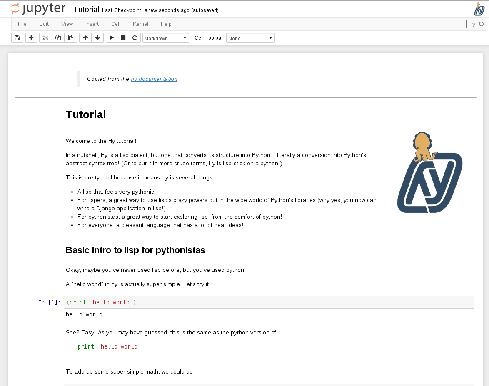

# [hy_kernel][]

[![build-badge][]][build] [![pypi-badge][]][pypi]

A simple [Jupyter][] kernel for [Hy](http://hylang.org), a pythonic lisp.

[ _The Hy tutorial as a Jupyter Notebook_][tutorial]


## Features
- basic REPL functionality
- autocomplete with most special Hy constructs
- syntax highlighting from [lighttable-hylang][]
- [cell and line magics][magic]
- [interactive widgets][widgets]
- [pretty good tests][build]


## Installation


### pip
```shell
pip install hy_kernel
```


### docker
You can try out Hy Kernel in Docker with [Docker Compose][docker-compose]:

```bash
git clone https://github.com/bollwyvl/hy_kernel.git
cd hy_kernel && docker-compose up
```

## Execution
To start the notebook in your directory of choice, with a running Hy kernel:

```console
ipython console --kernel hy
```

Or the notebook web GUI:

```shell
ipython notebook
```

Or:
```shell
ipython qtconsole --kernel hy
```

Or:
Your GUI might have a kernel selector: In the Web GUI it's in the
upper-right-hand corner. Find it, and select `Hy` kernel from the kernel
selector.

![IPython Kernel Selector][kernel-selector]


## Implementation
This kernel subclasses [IPythonKernel][] directly, as opposed to using
[KernelBase][], which would probably the correct thing to do. This works, but
might be brittle. Each cell is run through [astor][], so you're actually
seeing hy → ast → py → ast. While this probably incurs additional overhead,
the benefits (free magics, widgets, all the history works) are just too great to
give up.


## Limitations

### QtConsole
A lot of things don't work quite right in the qt console, and this will not be
supported to the same extent as the HTML notebook and terminal console.

### Operators

_Issue #5_

Use of operators e.g. `*`, `+`, `/` as the left-most atom in an expression appears to
work:
```hylang
;; works
(+ 1 1)
```

Using operators as just about anything else doesn't:
```hylang
;; breaks
(reduce + [1 2 3])
```

#### Workaround
Use the `operator` module:

```hylang
(import (operator (mul add)))
(reduce mul [1 2 3])
```

This will probably need to be fixed upstream.


### Magic
Cell and line magics are "supported", with the following caveats.

#### "Inline" Line Magics

_Issue #13_

Because we don't have much whitespace control over what gets compiled, and can't
do dirty tricks with comments (the hy compiler strips them), inline/indented
line magics are probably not going to work.

```hylang
;; breaks
(if True (
  !ls
))
```

#### Raw Magics
Additionally, cell magics that should _not_ be parsed as Hy need to be _extra_-
magiced, with `%%%`. This is because there is no way to know whether a
particular magic expects python, or some other crazy thing e.g. html, ruby,
a file... not that `%%file` works anyway (see #12).

```hylang
%%html
<h1>This Breaks!</h1>
```

breaks, while

```hylang
%%%html
<h1>This Works!</h1>
```

works.


## Collaboration
Issues, pull requests, and forks are all supported and encouraged on the [Github
repository][hy_kernel].

This [discussion on `hylang-discuss`][discuss] is also a good place to chime in.

Additionally, the [Jupyter list][] can provide a larger perspective on how this
stuff fits into the larger picture of interactive computing.

[astor]: https://github.com/berkerpeksag/astor
[build-badge]: https://travis-ci.org/bollwyvl/hy_kernel.svg
[build]: https://travis-ci.org/bollwyvl/hy_kernel
[discuss]: https://groups.google.com/forum/#!topic/hylang-discuss/UkoET6pU5sM
[docker-compose]: https://docs.docker.com/compose/
[hy_kernel]: https://github.com/bollwyvl/hy_kernel
[IPythonKernel]: https://github.com/ipython/ipython/blob/master/IPython/kernel/zmq/ipkernel.py
[Jupyter]: http://jupyter.org
[Jupyter list]: https://groups.google.com/forum/#!forum/jupyter
[kernel-selector]: http://ipython.org/ipython-doc/dev/_images/kernel_selector_screenshot.png
[KernelBase]: https://github.com/ipython/ipython/blob/master/IPython/kernel/zmq/kernelbase.py
[lighttable-hylang]: https://github.com/cndreisbach/lighttable-hylang
[magic]: notebooks/Magics.ipynb
[pypi-badge]: https://img.shields.io/pypi/v/hy_kernel.svg
[pypi]: https://pypi.python.org/pypi/hy_kernel/
[tutorial]: http://nbviewer.ipython.org/github/bollwyvl/hy_kernel/blob/master/notebooks/Tutorial.ipynb
[widgets]: notebooks/Widgets.ipynb
